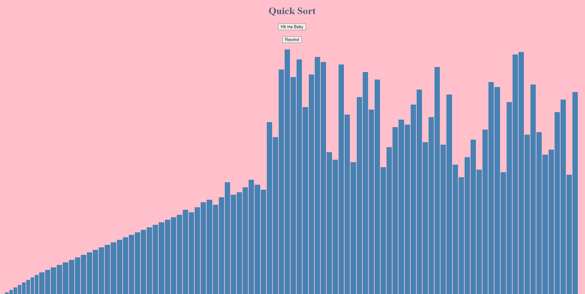

# Quicksort-Visualizer

<h1 id="intro">Introduction</h1>
This is an animated visualization of the quicksort algorithim made using the D3 library.

## To start the app:

### Run

### `yarn start`

Open localhost:4000 to open the app in the browser.
<h1 id="tech_stack">Tech Stack</h1>
Quicksort Visualizer was made using D3, JavaScript, HTML5, and CSS

